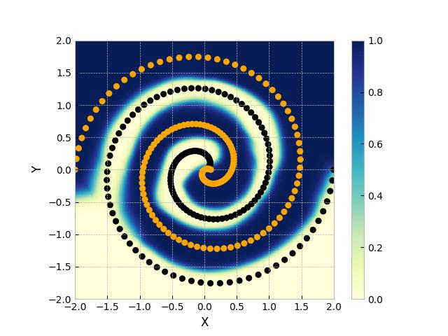
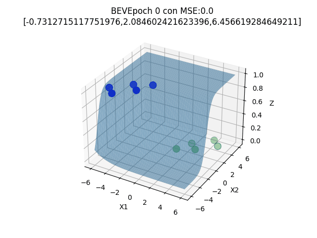

# AI PLAYGROUND

Welcome to AI playground, where you can mess around with several models including artificial, convolutional and recurrent neuronal networks in an interactive way. 

|  |  |
|---------------------------|----------------------------------|


## Usage
1. Clone repository:
    ```bash
    git clone https://github.com/BrandomVega/AI_playground.git
    cd AI_playground
    ```

2. Create python virtual environment:
    ```bash
    python -m venv venv
    source venv/bin/activate
    ```
3. Install dependencies
    ```bash
    pip install -r requirements.txt
    ```
4. Track and register your models with mlflow
    ```bash
    cd models/mlp
    python models.py
    python build_model.py
    ```
5. Serve the model locally or build a container from your model
   
    Some useful command lines
    ```bash
    mlflow models serve -m "models:/{MODEL}/1" --port {PORT}
    mlflow models build-docker --model-uri "models:/{MODEL}/1" --name "{NAME}"    
    ```
7. Choose the page to serve with flask.
   
    From neural_networks
    ```bash
    cd neural-networks && python app.py
    ```


